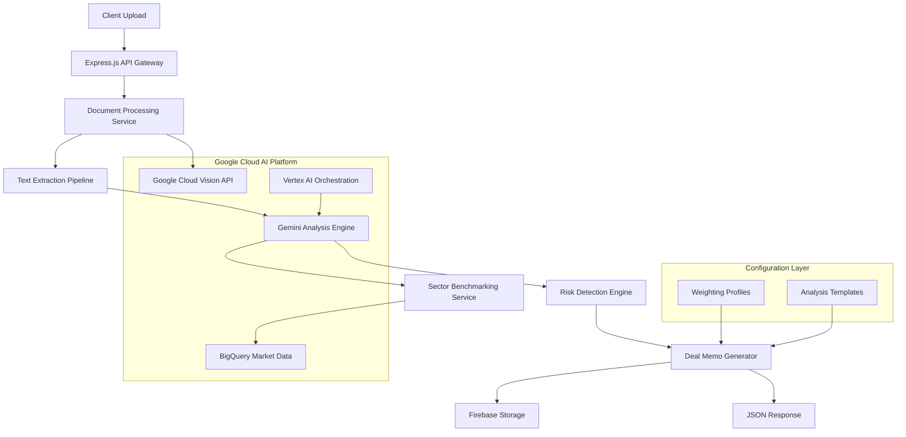

# Design Document

## Overview

The AI Deal Memo Generation system is designed as a microservices architecture leveraging Google Cloud AI Platform services. The system processes multiple document types through a pipeline that extracts structured data, performs sector benchmarking, identifies risks, and generates investment-ready deal memos. The architecture emphasizes scalability, reliability, and integration with Google AI technologies while maintaining the existing Node.js/Express foundation.

## Architecture

### High-Level Architecture



### Service Architecture

The system follows a layered architecture pattern:

1. **API Layer**: Express.js endpoints handling HTTP requests and responses
2. **Processing Layer**: Document parsing and text extraction services
3. **AI Analysis Layer**: Gemini-powered content analysis and entity extraction
4. **Data Layer**: BigQuery for benchmarking, Firebase for persistence
5. **Integration Layer**: Google Cloud AI service orchestration

## Components and Interfaces

### Document Processing Service

**Purpose**: Handles multi-format document ingestion and text extraction

**Key Components**:
- `DocumentParser`: Factory pattern for different file types (PDF, DOCX, PPTX)
- `TextExtractor`: Unified interface for text extraction with metadata preservation
- `OCRProcessor`: Google Cloud Vision integration for image-based content
- `ContentStructurer`: Identifies document sections and maintains source attribution

**Interfaces**:
```typescript
interface DocumentProcessor {
  processDocument(file: Buffer, type: string): Promise<ProcessedDocument>
  extractMetadata(document: ProcessedDocument): DocumentMetadata
  validateContent(document: ProcessedDocument): ValidationResult
}

interface ProcessedDocument {
  id: string
  sourceType: DocumentType
  extractedText: string
  sections: DocumentSection[]
  metadata: DocumentMetadata
  processingTimestamp: Date
}
```

### AI Analysis Engine

**Purpose**: Orchestrates Gemini models for content analysis and entity extraction

**Key Components**:
- `GeminiAnalyzer`: Primary analysis engine using Gemini Pro models
- `EntityExtractor`: Identifies key investment metrics and data points
- `ConsistencyChecker`: Cross-references data across multiple documents
- `PromptManager`: Manages structured prompts for different analysis types

**Interfaces**:
```typescript
interface AIAnalyzer {
  analyzeContent(documents: ProcessedDocument[]): Promise<AnalysisResult>
  extractEntities(text: string, context: AnalysisContext): Promise<EntitySet>
  validateConsistency(entities: EntitySet[]): Promise<ConsistencyReport>
}

interface AnalysisResult {
  companyProfile: CompanyProfile
  extractedMetrics: InvestmentMetrics
  marketClaims: MarketClaims
  teamAssessment: TeamProfile
  consistencyFlags: ConsistencyIssue[]
}
```

### Sector Benchmarking Service

**Purpose**: Provides market context and peer comparisons using BigQuery data

**Key Components**:
- `BigQueryConnector`: Manages connections and queries to market datasets
- `SectorClassifier`: Determines appropriate sector and peer group
- `MetricComparator`: Calculates percentile rankings and relative performance
- `BenchmarkCache`: Caches frequently accessed benchmark data

**Interfaces**:
```typescript
interface BenchmarkingService {
  classifySector(companyProfile: CompanyProfile): Promise<SectorClassification>
  getBenchmarks(sector: string, metrics: string[]): Promise<BenchmarkData>
  calculatePercentiles(metrics: InvestmentMetrics, benchmarks: BenchmarkData): Promise<PercentileRankings>
}

interface BenchmarkData {
  sector: string
  sampleSize: number
  metrics: Record<string, MetricDistribution>
  lastUpdated: Date
}
```

### Risk Detection Engine

**Purpose**: Identifies potential red flags and inconsistencies across data sources

**Key Components**:
- `InconsistencyDetector`: Flags metric discrepancies between documents
- `MarketSizeValidator`: Validates TAM/SAM claims against known data
- `MetricAnomalyDetector`: Identifies unusual patterns in financial metrics
- `CompetitiveAnalyzer`: Assesses competitive landscape completeness

**Interfaces**:
```typescript
interface RiskDetector {
  detectInconsistencies(analysisResults: AnalysisResult[]): Promise<RiskFlag[]>
  validateMarketClaims(marketClaims: MarketClaims): Promise<ValidationResult>
  assessMetricHealth(metrics: InvestmentMetrics): Promise<MetricHealthReport>
}

interface RiskFlag {
  type: RiskType
  severity: 'HIGH' | 'MEDIUM' | 'LOW'
  description: string
  affectedMetrics: string[]
  suggestedMitigation: string
  sourceDocuments: string[]
}
```

### Deal Memo Generator

**Purpose**: Synthesizes analysis into structured investment recommendations

**Key Components**:
- `ScoreCalculator`: Applies configurable weightings to generate signal scores
- `RecommendationEngine`: Generates investment thesis and recommendations
- `JSONValidator`: Ensures output conforms to deal memo schema
- `WeightingManager`: Handles customizable analysis weightings

**Interfaces**:
```typescript
interface DealMemoGenerator {
  generateMemo(
    analysis: AnalysisResult,
    benchmarks: BenchmarkData,
    risks: RiskFlag[],
    weightings: AnalysisWeightings
  ): Promise<DealMemo>
  
  calculateSignalScore(
    metrics: InvestmentMetrics,
    weightings: AnalysisWeightings
  ): Promise<number>
}

interface AnalysisWeightings {
  marketOpportunity: number  // Default: 25%
  team: number              // Default: 25%
  traction: number          // Default: 20%
  product: number           // Default: 15%
  competitivePosition: number // Default: 15%
}
```

## Data Models

### Core Data Structures

```typescript
interface CompanyProfile {
  name: string
  oneLiner: string
  sector: string
  stage: FundingStage
  foundedYear: number
  location: string
  website?: string
}

interface InvestmentMetrics {
  revenue: {
    arr?: number
    mrr?: number
    growthRate?: number
    projectedArr?: number[]
  }
  traction: {
    customers?: number
    customerGrowthRate?: number
    churnRate?: number
    nps?: number
  }
  team: {
    size: number
    foundersCount: number
    keyHires: TeamMember[]
  }
  funding: {
    totalRaised?: number
    lastRoundSize?: number
    lastRoundDate?: Date
    currentAsk?: number
    valuation?: number
  }
}

interface DealMemo {
  aegisDealMemo: {
    summary: {
      companyName: string
      oneLiner: string
      signalScore: number
      recommendation: RecommendationType
    }
    keyBenchmarks: BenchmarkComparison[]
    growthPotential: {
      upsideSummary: string
      growthTimeline: string
    }
    riskAssessment: {
      highPriorityRisks: RiskFlag[]
      mediumPriorityRisks: RiskFlag[]
    }
    investmentRecommendation: {
      narrative: string
      idealCheckSize: string
      idealValuationCap: string
      keyDiligenceQuestions: string[]
    }
  }
}
```

## Error Handling

### Error Categories and Strategies

1. **Document Processing Errors**
   - Corrupted files: Return specific error with file validation details
   - Unsupported formats: Graceful degradation with manual upload option
   - OCR failures: Retry with different processing parameters

2. **AI Service Errors**
   - API rate limits: Implement exponential backoff and request queuing
   - Model unavailability: Fallback to alternative models or cached results
   - Parsing failures: Return partial results with error annotations

3. **Data Integration Errors**
   - BigQuery timeouts: Use cached benchmark data with staleness indicators
   - Firebase connection issues: Store results locally with sync retry logic
   - Missing benchmark data: Expand sector search or use broader comparisons

4. **Validation Errors**
   - Schema violations: Return detailed validation errors with correction suggestions
   - Inconsistent data: Flag issues but continue processing with warnings
   - Missing required fields: Prompt for additional information or mark as incomplete

### Error Response Format

```typescript
interface ErrorResponse {
  success: false
  error: {
    code: string
    message: string
    details?: Record<string, any>
    retryable: boolean
    suggestedAction?: string
  }
  partialResults?: Partial<DealMemo>
}
```

## Testing Strategy

### Unit Testing
- **Document Processing**: Test each parser with sample files of varying complexity
- **AI Analysis**: Mock Gemini responses to test entity extraction and consistency checking
- **Benchmarking**: Test percentile calculations with known datasets
- **Risk Detection**: Validate flag generation with synthetic inconsistent data
- **Deal Memo Generation**: Test JSON schema compliance and weighting calculations

### Integration Testing
- **Google Cloud Services**: Test actual API integrations with rate limiting and error handling
- **End-to-End Workflows**: Process complete document sets through full pipeline
- **Performance Testing**: Validate response times with large document sets
- **Concurrent Processing**: Test system behavior under multiple simultaneous requests

### Test Data Strategy
- **Synthetic Documents**: Generate test pitch decks and transcripts with known metrics
- **Benchmark Datasets**: Create mock BigQuery responses for consistent testing
- **Error Scenarios**: Prepare corrupted files and invalid data for error path testing
- **Edge Cases**: Test with minimal data, conflicting information, and missing sections

### Validation Framework
- **Schema Validation**: Automated testing of JSON output against defined schemas
- **Business Logic Validation**: Verify signal score calculations and recommendation logic
- **Data Consistency**: Cross-check extracted metrics against source documents
- **Performance Benchmarks**: Establish SLA targets for processing times and accuracy metrics